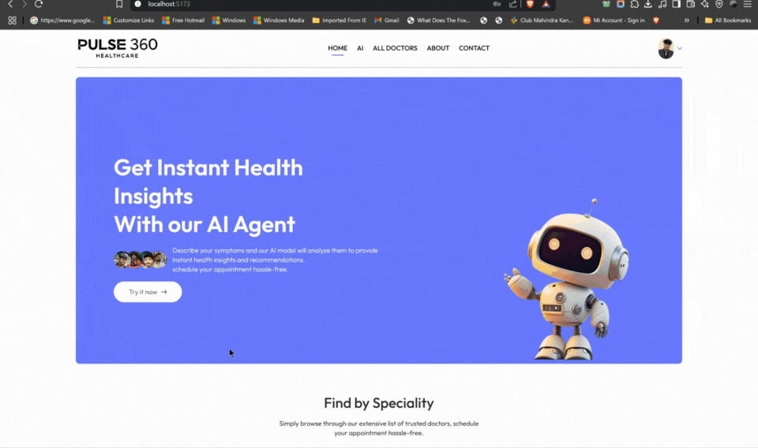

# 🩺 PULSE 360 – Smart AI-Based Health Pre-Diagnosis & Doctor Booking Platform

PULSE 360 is a full-stack web-based health assistant that bridges AI-driven symptom analysis with seamless doctor consultations. Designed especially for elderly and non-tech-savvy users, this platform minimizes unnecessary hospital visits and guides patients toward informed healthcare decisions using AI and telemedicine.

---

## 🚀 Features

- 🧠 **AI Health Assistant**  
  - Chat-based interaction with an AI trained on structured medical datasets.  
  - Call-based voice support for elderly users who prefer talking over typing.  
  - Pill-style suggested questions reduce cognitive load and user hesitation.  
  - Provides condition suggestions, descriptions, diet and exercise plans.

- 📞 **Call Support for the Elderly**  
  - AI voice agent calls the patient to discuss symptoms in a natural way.  
  - Reduces tech barrier for users uncomfortable with reading or typing.

- 🩺 **Doctor Appointment System**  
  - Search by specialization and check doctor availability.  
  - Book appointments with real doctors through a clean, intuitive interface.  
  - Integrated Razorpay payment system for secure booking.

- 🛠️ **Admin Panel**  
  - Manage doctor profiles, set availability, and view scheduled appointments.  
  - Centralized control for admins and staff to oversee operations.

---

## 🎯 Why PULSE 360?

Elderly patients often struggle with modern interfaces. They hesitate to ask questions due to embarrassment or cognitive load. Doctors often lack time to provide in-depth lifestyle advice, and minor health issues unnecessarily escalate due to delayed action.

PULSE 360 solves this by:

- Enabling **voice-based AI** interactions for natural communication.  
- Providing **suggested prompts** to simplify symptom description.  
- Offering **early AI-based assessments** before needing to see a doctor.  
- Letting patients **book consultations only if needed**, reducing hospital queues.  
- Serving as a **lifestyle guide**, not just a symptom checker.

---

## ❗ Problems We Solved

- ❌ No voice-based AI support for elderly users.
- ❌ Patients hesitate to ask "basic" questions in clinics.
- ❌ Doctors don't always provide personalized lifestyle guidance.
- ❌ AI systems and doctor appointments were previously disjointed.
- ❌ Long queues and hospital visits for issues manageable at home.

---

## 🧰 Tech Stack

- **Frontend**: React.js, Tailwind CSS  
- **Backend**: Node.js, Express.js  
- **Database**: MongoDB (Mongoose)  
- **Authentication**: JWT  
- **Payments**: Razorpay  
- **Media Hosting**: Cloudinary  
- **AI Integration**: OpenAI API for Chatbot Logic  
- **Call Agent (planned/future)**: Twilio / custom voice bot

---

## 🗂️ Folder Structure (High-Level)

# 🩺 PULSE 360 – Smart AI-Based Health Pre-Diagnosis & Doctor Booking Platform

 <!-- Replace with actual GIF link -->

PULSE 360 is a full-stack web-based health assistant that bridges AI-driven symptom analysis with seamless doctor consultations. Designed especially for elderly and non-tech-savvy users, this platform minimizes unnecessary hospital visits and guides patients toward informed healthcare decisions using AI and telemedicine.

---

## 🚀 Features

- 🧠 **AI Health Assistant**  
  - Chat-based interaction with an AI trained on structured medical datasets.  
  - Call-based voice support for elderly users who prefer talking over typing.  
  - Pill-style suggested questions reduce cognitive load and user hesitation.  
  - Provides condition suggestions, descriptions, diet and exercise plans.

- 📞 **Call Support for the Elderly**  
  - AI voice agent calls the patient to discuss symptoms in a natural way.  
  - Reduces tech barrier for users uncomfortable with reading or typing.

- 🩺 **Doctor Appointment System**  
  - Search by specialization and check doctor availability.  
  - Book appointments with real doctors through a clean, intuitive interface.  
  - Integrated Razorpay payment system for secure booking.

- 🛠️ **Admin Panel**  
  - Manage doctor profiles, set availability, and view scheduled appointments.  
  - Centralized control for admins and staff to oversee operations.

---

## 🎯 Why PULSE 360?

Elderly patients often struggle with modern interfaces. They hesitate to ask questions due to embarrassment or cognitive load. Doctors often lack time to provide in-depth lifestyle advice, and minor health issues unnecessarily escalate due to delayed action.

PULSE 360 solves this by:

- Enabling **voice-based AI** interactions for natural communication.  
- Providing **suggested prompts** to simplify symptom description.  
- Offering **early AI-based assessments** before needing to see a doctor.  
- Letting patients **book consultations only if needed**, reducing hospital queues.  
- Serving as a **lifestyle guide**, not just a symptom checker.

---

## ❗ Problems We Solved

- ❌ No voice-based AI support for elderly users.
- ❌ Patients hesitate to ask "basic" questions in clinics.
- ❌ Doctors don't always provide personalized lifestyle guidance.
- ❌ AI systems and doctor appointments were previously disjointed.
- ❌ Long queues and hospital visits for issues manageable at home.

---

## 🧰 Tech Stack

- **Frontend**: React.js, Tailwind CSS  
- **Backend**: Node.js, Express.js  
- **Database**: MongoDB (Mongoose)  
- **Authentication**: JWT  
- **Payments**: Razorpay  
- **Media Hosting**: Cloudinary  
- **AI Integration**: OpenAI API for Chatbot Logic  
- **Call Agent (planned/future)**: Twilio / custom voice bot

---
